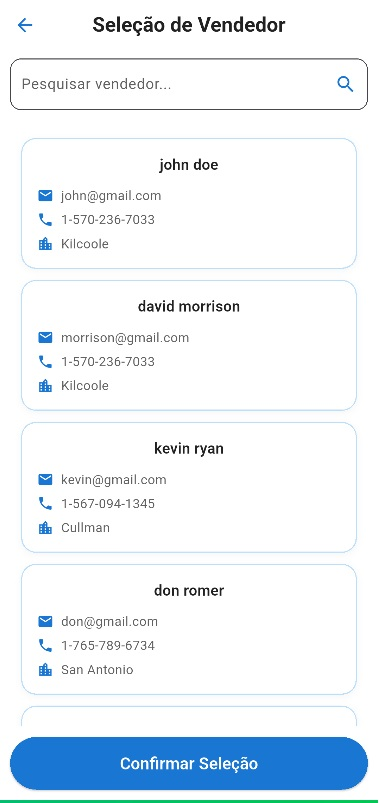
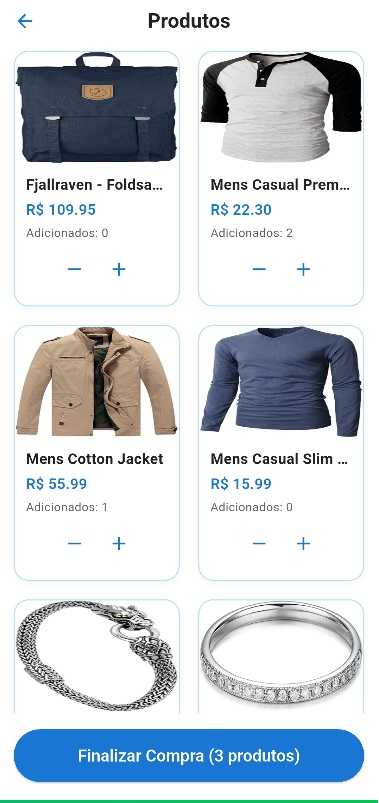
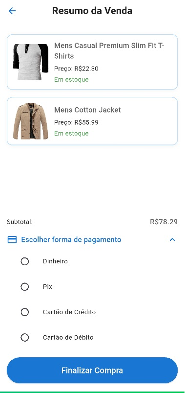

# 📱 PDV Flutter App

Um sistema de ponto de venda (PDV) desenvolvido com **Flutter 3.29.2**, voltado para smartphones. O app permite que vendedores sejam selecionados, produtos adicionados ao carrinho, vendas sejam finalizadas com pagamento em dinheiro.

---

## ✨ Funcionalidades

- Seleção de vendedor
- Listagem de produtos com controle de quantidade
- Carrinho de compras e resumo da venda
- Pagamento com cálculo de troco
- Integração com backend de vendas (mocked com FakeStore API)
- Design com tema customizado

---

## 📸 Screenshots

> Você pode adicionar imagens dentro da pasta `screenshots/`  
> Exemplo de como exibir:

| Seleção de Vendedor                | Tela de Produtos                     | Tela de Resumo                          |
|------------------------------------|--------------------------------------|-----------------------------------------|
|  |  |  |

---

## 🚀 Como Rodar o Projeto

### ✅ Pré-requisitos

- Flutter **3.29.2** instalado
- Android Studio, VSCode ou outro editor compatível
- Emulador Android ou dispositivo físico

### 📦 Instale as dependências

```bash
flutter pub get
```

### 🛠️ Execute o projeto

```bash
flutter run
```

> O comando acima irá compilar e abrir o app no dispositivo/emulador conectado.

---

## 🧱 Build (Release)

### APK (Android)

```bash
flutter build apk --release
```


## 📁 Estrutura do Projeto

```bash
lib/
├── domain/           # Entidades
├── service/     # Regra de negocio
│   └── bloc/         # Blocs e estados
├── repository/       # Repositórios e interfaces
├── presentation/       # UI e UX
│   └── screens/        # Telas
│   └── widgets/        # Widgets utilizados nas telas
├── common/
│   └── theme/        # Cores, estilos e gradientes
│   └── api/        # Configuração da api
```

---

## ✍️ Autor

Desenvolvido por **Elexandro Torres Tavares** como teste tecnico da **Data System.**  
💻 Contato: elexandro.torres@gmail.com

---

## 📝 Licença

Este projeto está sob a licença MIT.